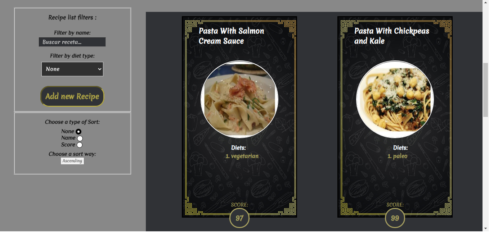

# Hola! soy Braian👋 

  

<!--
**braian-97/braian-97** is a ✨ _special_ ✨ repository because its `README.md` (this file) appears on your GitHub profile.

Here are some ideas to get you started:

- 🔭 I’m currently working on ...
- 🌱 I’m currently learning ...
- 👯 I’m looking to collaborate on ...
- 🤔 I’m looking for help with ...
- 💬 Ask me about ...
- 📫 How to reach me: ...
- 😄 Pronouns: ...
- ⚡ Fun fact: ...
-->

## Lenguajes y herramientas: 💻
 

         
  
  
  
  
  
  
  
  
  

 

## Mi proyecto:

#### Este fui mi primer proyecto desde cero, espero que les guste 😄

### API-Food

 
 
 
 
 

### Desarrollada con:
|--| FrontEnd |--|

React 
Redux

|--| BackEnd |--|

NodeJs 
Express 
Sequelize 
PostgresSQL

|--| Testing |--|

Mocha 
Chai 
Enzyme

|--| CSS |--|

CSS Modules 

### Datos traidos de Spoonacular:

## Me podes contactar en:

 
 <address>
  
 braian.silva97@gmail.com
 </address>

