

  # Hola! soy Braian👋 

  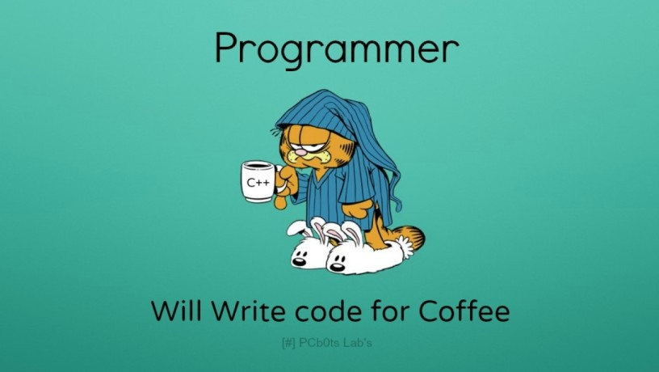

<!--
**braian-97/braian-97** is a ✨ _special_ ✨ repository because its `README.md` (this file) appears on your GitHub profile.

Here are some ideas to get you started:

- 🔭 I’m currently working on ...
- 🌱 I’m currently learning ...
- 👯 I’m looking to collaborate on ...
- 🤔 I’m looking for help with ...
- 💬 Ask me about ...
- 📫 How to reach me: ...
- 😄 Pronouns: ...
- ⚡ Fun fact: ...
-->

# Soy Full Stack Developer 💻

## Lenguajes y herramientas: 
 

&nbsp;&nbsp;
 &nbsp;&nbsp;
&nbsp;&nbsp;
 &nbsp;&nbsp;
&nbsp;&nbsp;&nbsp;&nbsp;
&nbsp;&nbsp;
&nbsp;&nbsp;
&nbsp;&nbsp;
&nbsp;&nbsp;
&nbsp;&nbsp;
 

## Mis proyectos:

#### Este fue mi primer proyecto desde cero. ⚡

### API-Food

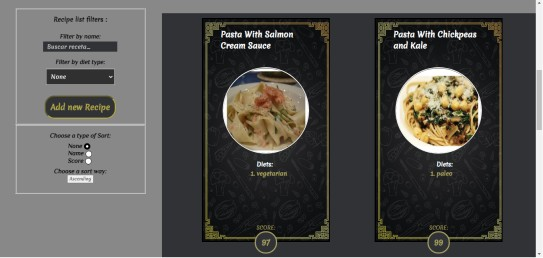
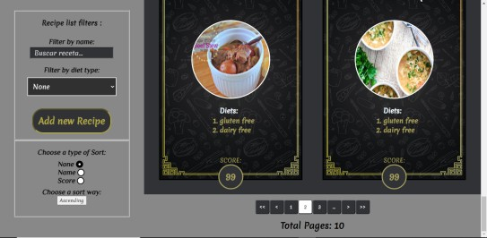
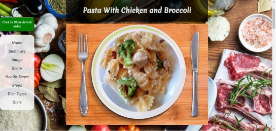
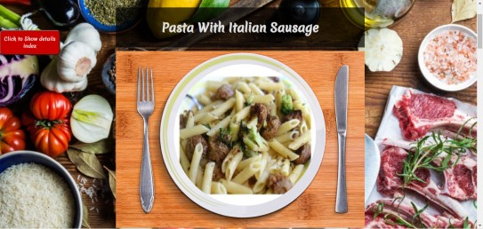
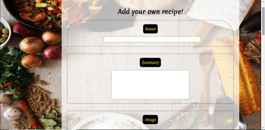
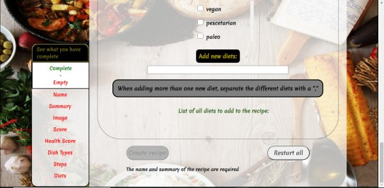

### Desarrollada con:
- FrontEnd: 

React 
Redux

- BackEnd:

NodeJs 
Express 
Sequelize 
PostgresSQL

- Testing: 

Mocha 
Chai 
Enzyme

- CSS: 

CSS Modules 

### Datos traidos de Spoonacular:

## Proyecto Grupal para Henry. 👯

### E-Commerce

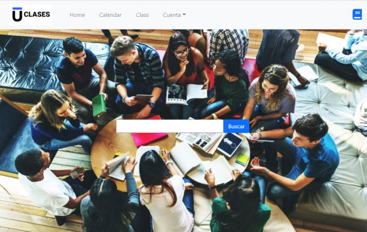
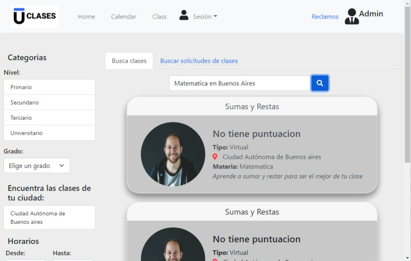
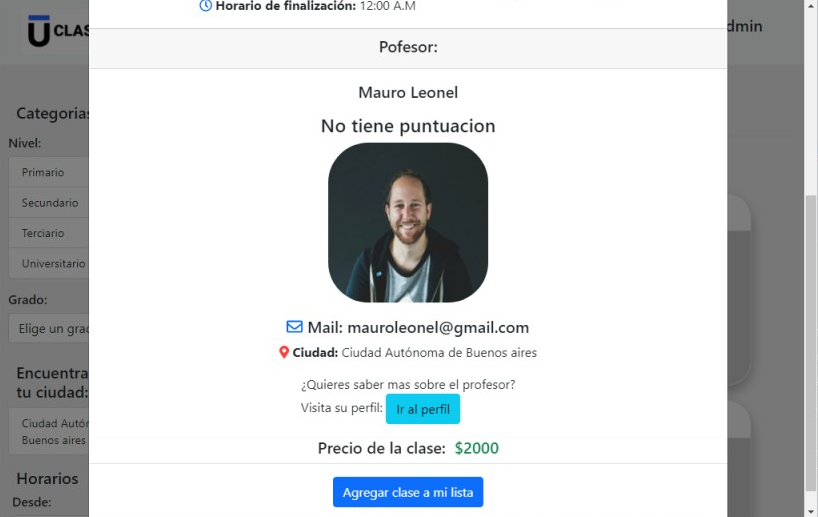
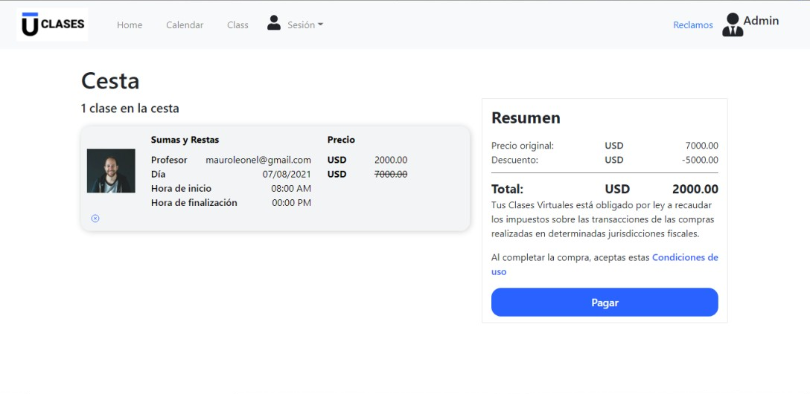
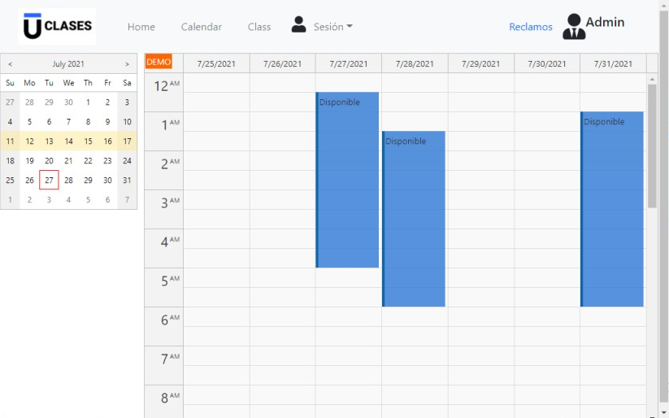
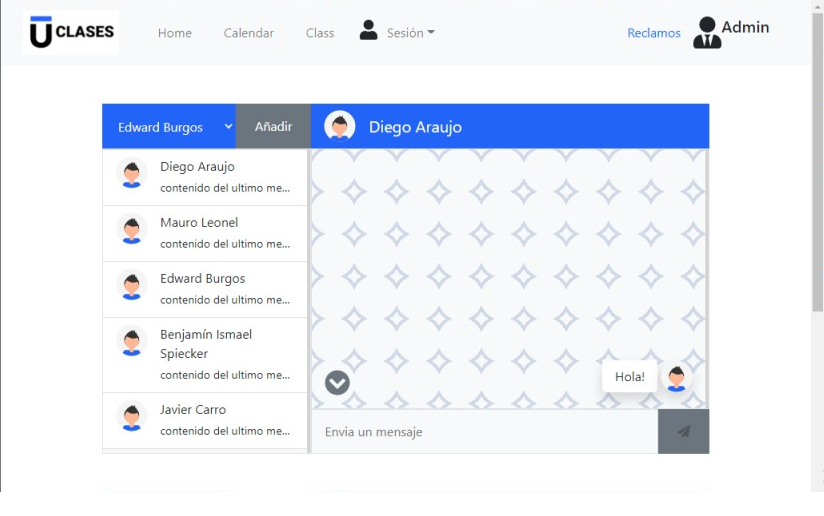

### Desarrollada con:

- Aplicación:

Creada usando TypeScript y Javascript 

- FrontEnd:

React 
Redux 
Firebase

- BackEnd:

NodeJs 
Express 
Sequelize 
PostgresSQL 
Jsonwebtoken 
Localstorage

- CSS: 

Bootstrap 
CSS Modules 

## Me podes contactar en:

<braian.silva97@gmail.com>

