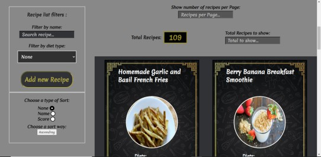

# Hola! soy Braian👋 

  

<!--
**braian-97/braian-97** is a ✨ _special_ ✨ repository because its `README.md` (this file) appears on your GitHub profile.

Here are some ideas to get you started:

- 🔭 I’m currently working on ...
- 🌱 I’m currently learning ...
- 👯 I’m looking to collaborate on ...
- 🤔 I’m looking for help with ...
- 💬 Ask me about ...
- 📫 How to reach me: ...
- 😄 Pronouns: ...
- ⚡ Fun fact: ...
-->
# Soy Full Stack Developer 💻

## Lenguajes y herramientas: 
 

&nbsp;&nbsp;&nbsp;&nbsp;&nbsp;&nbsp;&nbsp;&nbsp;&nbsp;&nbsp;&nbsp;&nbsp;&nbsp;&nbsp;&nbsp;&nbsp;&nbsp;&nbsp;&nbsp;&nbsp;&nbsp;&nbsp;&nbsp;&nbsp;&nbsp;&nbsp;&nbsp;

## Mi proyecto:

#### Este fue mi primer proyecto desde cero. 😄

### API-Food

### Desarrollada con:
|--| FrontEnd |--|

React 
Redux

|--| BackEnd |--|

NodeJs 
Express 
Sequelize 
PostgresSQL

|--| Testing |--|

Mocha 
Chai 
Enzyme

|--| CSS |--|

CSS Modules 

### Datos traidos de Spoonacular:

## Me podes contactar en:

<braian.silva97@gmail.com>

